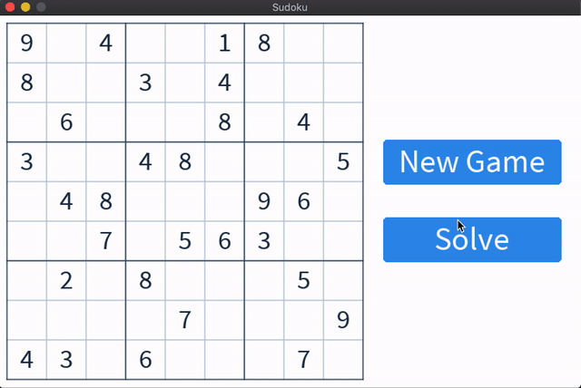

# Sudoku Solver

A sudoku game which also solves itself



## Why did I make this?

I did this project to learn and implement some simple game development and backtracking algorithm.

## How can I run this?

1. Clone the project.

```bash
git clone https://github.com/turalnovruzov/sudoku-solver.git
```

2. `cd` into the project's directory

```bash
cd sudoku-solver/
```

3. Use [Love2D](https://love2d.org/wiki/Getting_Started) to launch the game

```bash
love .
```